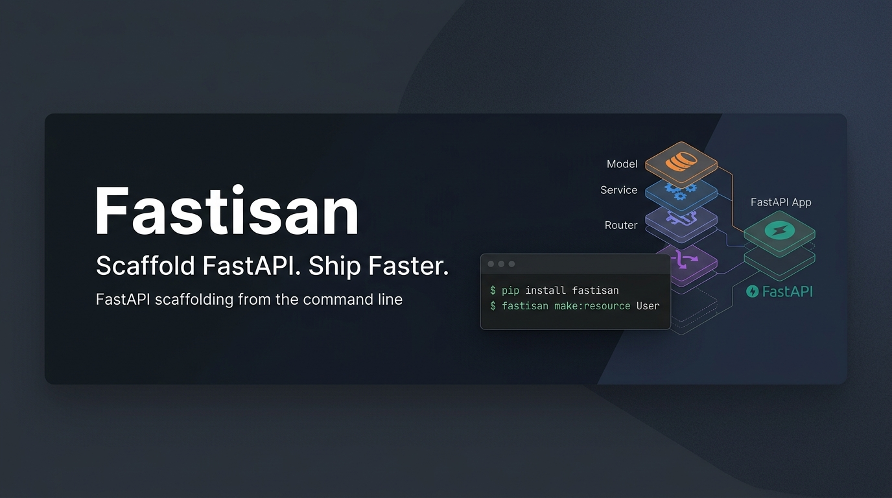

<div align="center">
  

# Fastisan

### Scaffold FastAPI applications without writing the same boilerplate again.

Generate models, schemas, repositories, services, routers, middleware,
database foundations, and complete CRUD resources from the command line.

[](https://pypi.org/project/fastisan/)
[](https://pypi.org/project/fastisan/)
[](LICENSE)
[](https://github.com/itsdevcode/fastisan/stargazers)

**[Installation](#installation) • [Quick Start](#quick-start) • [What it Generates](#what-fastisan-generates) • [Architecture](#architecture) • [Commands](#commands) • [Roadmap](#roadmap)**

</div>

---

## ⚡ What is Fastisan?

Building scalable FastAPI applications often requires repetitive setup: defining SQLAlchemy models, Pydantic schemas, setting up a Repository pattern, creating Service layers for business logic, mapping them to Routers, and configuring Alembic migrations.

**Fastisan** automates this entire process. With a single command, you can generate a robust, layered architecture for any resource, allowing you to focus on the actual business logic rather than writing boilerplate code.

---

## 🚀 Installation

Install Fastisan globally or in your project's virtual environment via pip:

```bash
pip install fastisan
```

---

## 🚦 Quick Start

Initialize a new Fastisan project and generate your first complete CRUD resource in seconds:

```bash
mkdir my-api && cd my-api

# 1. Initialize the FastAPI foundation (database, alembic, core files)
fastisan init

# 2. Scaffold a complete User resource with specific fields
fastisan make:resource User \
  --fields "name:str,email:str,age:int?"
```

### The Terminal Experience

```text
$ fastisan make:resource User --fields "name:str,email:str,age:int?"

Generating Model...
Generating Schema...
Generating Repository...
Generating Service...
Generating Router...

✨ Successfully scaffolded User resource!
```

### What it Generates

When you run the `make:resource` command, Fastisan automatically sets up the complete layered structure for you:

```text
app/
├── models/
│   └── user.py        # SQLAlchemy Model
├── schemas/
│   └── user.py        # Pydantic Schemas (Create, Update, Read)
├── repositories/
│   └── user.py        # Async Database Operations
├── services/
│   └── user.py        # Business Logic Layer
└── routers/
    └── user.py        # FastAPI API Endpoints
```

### From one command to a complete resource

```text
                    fastisan make:resource User
                              │
             ┌────────────────┼────────────────┐
             │                │                │
             ▼                ▼                ▼
           Model            Schema         Repository
                                                │
                                                ▼
                                             Service
                                                │
                                                ▼
                                             Router
                                                │
                                                ▼
                                             FastAPI
```

---

## 🛠 What Fastisan Generates

| Command | Generates | Description |
|---|---|---|
| `fastisan init` | Application foundation | Sets up FastAPI, SQLAlchemy db config, Alembic migrations, and directory structure. |
| `make:model` | SQLAlchemy model | Creates an async SQLAlchemy declarative base model. |
| `make:schema` | Pydantic schemas | Scaffolds Create, Update, and Response schemas for validation. |
| `make:repository` | Async repository | Sets up the data access layer for CRUD operations. |
| `make:service` | Service layer | Creates a service class for separating business logic from routers. |
| `make:router` | FastAPI router | Generates standard RESTful API endpoints mapped to the service layer. |
| `make:middleware` | ASGI middleware | Creates a skeleton for custom request/response interception. |
| `make:resource` | **Complete CRUD resource** | Coordinates the generation of a full, layered API resource instantly. |

---

## 🏗 Architecture

Fastisan generates a clean, layered architectural pattern, keeping your codebase maintainable and scalable as it grows:

```text
   Client Request
         │
         ▼
      FastAPI (app)
         │
         ▼
      Router  <───────── Request Validation (Schemas)
         │
         ▼
      Service <───────── Business Logic
         │
         ▼
    Repository <──────── Data Access Abstraction
         │
         ▼
   AsyncSession
         │
         ▼
       Database
```

---

## 💻 Commands

Fastisan provides a variety of commands to streamline your workflow. You can view all available commands by running `fastisan --help`. Below are the core commands:

- `fastisan init`: Scaffolds the initial FastAPI project structure.
- `fastisan make:resource <name>`: Generates a complete API resource (Model, Schema, Repository, Service, Router).
- `fastisan make:model <name>`: Generates a SQLAlchemy model.
- `fastisan make:schema <name>`: Generates Pydantic schemas.
- `fastisan make:repository <name>`: Generates an async repository class.
- `fastisan make:service <name>`: Generates a business logic service layer.
- `fastisan make:router <name>`: Generates a FastAPI APIRouter.

---

## 📦 Database & Alembic

Fastisan relies on async SQLAlchemy and Alembic out of the box. The `fastisan init` command prepares everything you need to start migrating.

```bash
# After generating a new resource, create a migration
alembic revision --autogenerate -m "Added User resource"

# Apply the migration to your database
alembic upgrade head
```

---

## 🚧 Current Limitations (v0.1.0)

- **Early Stage (Pre-Alpha):** Fastisan is currently in early development and APIs/generated structures may change.
- **Database Support:** Defaults to **async SQLAlchemy** (tested with PostgreSQL + asyncpg). Synchronous repositories and other database engines are not explicitly supported yet.
- **Relationships:** Relationships between models (e.g., One-to-Many, Many-to-Many) must be configured manually after scaffolding.
- **Field Constraints:** Advanced field constraints (like unique, index, length) via CLI arguments are limited and may require manual updates to the generated models.

---

## 🗺 Roadmap

- [ ] Support for richer field constraints via CLI (e.g., `email:str:unique:index`).
- [ ] Automatic generation of model relationships and Foreign Keys.
- [ ] Generated-project dependency management (automatic additions to requirements).
- [ ] Dry-run mode (`--dry-run`) to preview generated files without writing them.
- [ ] `fastisan inspect` or `doctor` commands to check project health and configuration.

---

## 🤝 Contributing

We welcome contributions! If you'd like to help improve Fastisan, please check out our [Contributing Guidelines](CONTRIBUTING.md).

1. Fork the repository
2. Create a feature branch (`git checkout -b feature/amazing-feature`)
3. Commit your changes (`git commit -m 'Add some amazing feature'`)
4. Push to the branch (`git push origin feature/amazing-feature`)
5. Open a Pull Request

---

## 👤 Author

**Arun Yadav** - [itsdevcode@gmail.com](mailto:itsdevcode@gmail.com)

---

<div align="center">
  Built with ❤️ for the FastAPI ecosystem.
</div>
